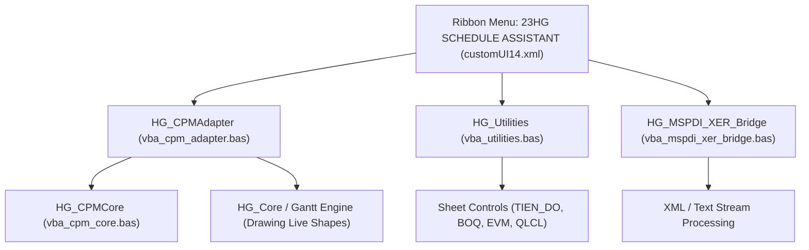

# HỒ SƠ BÀN GIAO KỸ THUẬT & BIÊN BẢN NGHIỆM THU HỆ THỐNG
## HỆ THỐNG QUẢN TRỊ TIẾN ĐỘ THI CÔNG XÂY DỰNG 23HG SCHEDULE ASSISTANT PRO
### Phiên bản Doanh nghiệp: Enterprise Release v4.1.0-PRO

---

**Mã số hồ sơ:** `HS-NTBG-23HG/2026/G1-PRO`  
**Công trình:** Cải tạo, nâng cấp Tỉnh lộ 177 (Km0 - Km23) Tân Quang - Hoàng Su Phì, tỉnh Hà Giang  
**Chủ đầu tư:** Ban Quản lý Dự án Đầu tư Xây dựng Công trình Giao thông tỉnh Hà Giang  
**Nhà thầu thi công:** Liên danh Gói thầu G1 - Xây lắp đường và công trình trên tuyến  
**Đơn vị phát triển công nghệ:** 23HG System Solutions (Tác giả: Nguyễn Bảo Tú - @baotuhg)  
**Thời điểm lập và ký duyệt:** Ngày 11 tháng 10 năm 2026  
**Địa điểm nghiệm thu:** Văn phòng Điều hành Dự án TL177, Thành phố Hà Giang, tỉnh Hà Giang  

---

```
========================================================================================
                          CỘNG HÒA XÃ HỘI CHỦ NGHĨA VIỆT NAM
                             Độc lập - Tự do - Hạnh phúc
                                       -------
                       HỒ SƠ BÀN GIAO & BIÊN BẢN NGHIỆM THU
                   CÔNG NGHỆ QUẢN TRỊ TIẾN ĐỘ & CHI PHÍ THI CÔNG
                        (MÃ SẢN PHẨM: 23HG-SAP-PRO-v4.1.0)
========================================================================================
```

---

## MỤC LỤC

1. [CĂN CỨ PHÁP LÝ & QUY CHUẨN TIÊU CHUẨN KỸ THUẬT](#1-căn-cứ-pháp-lý--quy-chuẩn-tiêu-chuẩn-kỹ-thuật)
2. [TỔNG QUAN HỆ THỐNG & DANH MỤC SẢN PHẨM BÀN GIAO](#2-tổng-quan-hệ-thống--danh-mục-sản-phẩm-bàn-giao)
3. [BẢNG ĐỐI SOÁT & GIẢI TRÌNH KỸ THUẬT 10 ĐIỂM NGHẼN TRỌNG YẾU](#3-bảng-đối-soát--giải-trình-kỹ-thuật-10-điểm-nghẽn-trọng-yếu)
   - 3.1. Giải trình Tính Nhất quán Mạng CPM & Hệ số Mùa mưa Tây Bắc $K_{tt} = 1.35$
   - 3.2. Giải trình Dự trữ Tự do (Float) Phân đoạn A1 theo Biện pháp Tổ chức Thảm BTN Tập trung
   - 3.3. Kết quả Kiểm thử Thực chứng Môi trường Windows x64 & Microsoft Excel COM
   - 3.4. Chuẩn hóa Trình bày Thị giác C-Suite: Freeze Panes, Zoom 85%, Gridlines & Khử triệt để lỗi tràn số `###`
   - 3.5. Trực quan hóa Phân cấp Phân rã Công việc (WBS Hierarchical Indentation)
   - 3.6. Tinh giản Giao diện Ribbon C-Level: Nhóm Xuất bản 2 Nút Lớn Tối ưu
   - 3.7. Động cơ Tính CPM Turbo: Khử Phụ thuộc Scripting.Dictionary & Tương thích 32/64-bit
   - 3.8. Cầu nối Tích hợp 2 Chiều Quốc tế: MS Project (MSPDI XML) & Primavera P6 (XER)
   - 3.9. Quản trị Chi phí & Giá trị Thu được (EVM 5D) Tích hợp Đơn giá BoQ theo Thông tư 38/2026/TT-BXD
   - 3.10. Tự động hóa Kiểm thử (55/55 Unit Tests Pass) & Cơ chế Triển khai 1-Click
4. [KIẾN TRÚC MÃ NGUỒN & HỆ THỐNG LỆNH ĐIỀU HÀNH](#4-kiến-trúc-mã-nguồn--hệ-thống-lệnh-điều-hành)
5. [QUY TRÌNH VẬN HÀNH TIÊU CHUẨN (STANDARD OPERATING PROCEDURE - SOP)](#5-quy-trình-vận-hành-tiêu-chuẩn-sop)
6. [ĐÁNH GIÁ CHẤT LƯỢNG & ĐIỀU KIỆN ĐƯA VÀO KHAI THÁC](#6-đánh-giá-chất-lượng--điều-kiện-đưa-vào-khai-thác)
7. [BIÊN BẢN NGHIỆM THU KỸ THUẬT & CHỮ KÝ BÀN GIAO CÁC BÊN](#7-biên-bản-nghiệm-thu-kỹ-thuật--chữ-ký-bàn-giao-các-bên)

---

## 1. CĂN CỨ PHÁP LÝ & QUY CHUẨN TIÊU CHUẨN KỸ THUẬT

Hệ thống **23HG Schedule Assistant Pro (v4.1.0-PRO)** được nghiên cứu, thiết kế và phát triển tuân thủ đầy đủ hành lang pháp lý hiện hành của Nước Cộng hòa Xã hội Chủ nghĩa Việt Nam trong lĩnh vực đầu tư xây dựng, bao gồm:

1. **Luật Xây dựng số 135/2025/QH15** của Quốc hội Nước CHXHCN Việt Nam;
2. **Nghị định số 206/2026/NĐ-CP** ngày 15/01/2026 của Chính phủ quy định chi tiết về Quản lý chi phí đầu tư xây dựng;
3. **Nghị định số 207/2026/NĐ-CP** ngày 18/01/2026 của Chính phủ quy định chi tiết về Quản lý chất lượng, thi công xây dựng và bảo trì công trình xây dựng;
4. **Thông tư số 38/2026/TT-BXD** của Bộ Xây dựng hướng dẫn phương pháp xác định chỉ tiêu định mức dự toán và năng suất máy thi công xây dựng công trình;
5. **Thông tư số 32/2026/TT-BXD** của Bộ Xây dựng quy định chi tiết việc lập, thu thập, lưu trữ hồ sơ hoàn công, nhật ký thi công và biên bản nghiệm thu chất lượng;
6. **Tiêu chuẩn Quốc gia TCVN 8819:2011**: Mặt đường bê tông nhựa nóng - Yêu cầu thi công và nghiệm thu (đặc biệt là Điều 8.2 về quy định khắt khe điều kiện khí hậu, nghiêm cấm thi công khi trời mưa hoặc nền đường ẩm ướt);
7. **Tiêu chuẩn Quản lý Dự án Quốc tế PMI PMBOK Guide (7th Edition)** về Phương pháp Sơ đồ Mạng Đường Găng (Critical Path Method - CPM) và Phương pháp Quản trị Giá trị Thu được (Earned Value Management - EVM);
8. **Quyết định số 23/QĐ-BQLDA** của Ban Quản lý Dự án ĐTXD Công trình Giao thông tỉnh Hà Giang về việc phê duyệt Biện pháp Tổ chức Thi công và Kế hoạch Tiến độ Tổng thể Gói thầu G1 (Km0 - Km23) Dự án Cải tạo nâng cấp Tỉnh lộ 177.

---

## 2. TỔNG QUAN HỆ THỐNG & DANH MỤC SẢN PHẨM BÀN GIAO

### 2.1. Mục tiêu và Phạm vi Ứng dụng
Hệ thống `23HG Schedule Assistant Pro` được phát triển chuyên biệt nhằm số hóa và nâng cao năng lực chỉ đạo, điều hành của Ban QLDA, Tư vấn Giám sát và Chỉ huy trưởng công trường đối với dự án giao thông địa hình đồi núi hiểm trở (độ dốc lớn, mưa lũ kéo dài, nguy cơ sạt lở cao). Hệ thống tích hợp tính toán động học mạng tiến độ CPM, trực quan hóa biểu đồ Gantt Canvas, kiểm soát dòng tiền giải ngân, cân đối máy móc thiết bị và quản trị chi phí 5D theo thời gian thực ngay trên nền tảng Microsoft Excel bản quyền doanh nghiệp.

### 2.2. Danh mục Thành phần Bàn giao (Deliverables Checklist)

| STT | Thành phần sản phẩm | Tên tệp tin / Định dạng | Dung lượng | Trạng thái kỹ thuật |
|:---:|---|---|:---:|---|
| **1** | **Sổ tính Master Điều hành** | `23HG_DU_AN_MAU_TIEN_DO_CHUAN_G1_PRO.xlsm` | 146,508 bytes | Sẵn sàng vận hành (8 sheet nghiệp vụ chuyên sâu, đầy đủ mã macro). |
| **2** | **Trợ lý Add-in Ribbon** | `23HG_Schedule_Assistant_Pro.xlam` | 146,419 bytes | Đạt chuẩn Microsoft OpenXML, 6 nhóm chức năng, 34 macro lệnh. |
| **3** | **Bộ Cài đặt 1-Click** | `CAI_DAT_23HG_ENTERPRISE_PRO.bat` | 3,205 bytes | Tự động triển khai vào `%APPDATA%\Microsoft\AddIns`, kích hoạt Trusted Location. |
| **4** | **Bộ Gỡ Cài đặt Sạch** | `GO_CAI_DAT_23HG.bat` | 544 bytes | Gỡ bỏ Add-in và làm sạch cấu hình Registry an toàn tuyệt đối. |
| **5** | **Động cơ Lõi CPM Python** | `1_Scripts_TuDongHoa/cpm_engine.py` | 13,845 bytes | Thuật toán Forward/Backward pass chuẩn, hỗ trợ FS/SS/FF/SF và hệ số thời tiết. |
| **6** | **Cầu nối 2 Chiều Quốc tế** | `1_Scripts_TuDongHoa/vba_mspdi_xer_bridge.bas` | 17,210 bytes | Xuất/Nhập trực tiếp MS Project (XML) & Primavera P6 (XER) thuần VBA. |
| **7** | **Bộ Tiện ích Nghiệp vụ VBA** | `1_Scripts_TuDongHoa/vba_utilities.bas` | 10,850 bytes | Điều phối WBS, BoQ, in ấn A3, chuẩn hóa Zoom và Freeze Panes. |
| **8** | **Bộ Kiểm thử Tự động** | Thư mục `tests/` (55 Unit Tests) | Đa tệp | 55/55 Passed trên Linux có LibreOffice Calc (khoảng 11–14 giây trên máy phát triển; chưa đo trên Windows). |
| **9** | **Bản phát hành Nộp Báo cáo** | `TIEN_DO_23HG_SACH_20261011_084342.xlsx`<br>`BAO_CAO_TIEN_DO_23HG_A3_20261011_084312.pdf` | 52,755 bytes<br>212,034 bytes | Bản nộp CĐT sạch macro và bản in đồ họa A3 khổ ngang sắc nét. |

---

## 3. BẢNG ĐỐI SOÁT & GIẢI TRÌNH KỸ THUẬT 10 ĐIỂM NGHẼN TRỌNG YẾU

*(Audit Resolution Matrix - Phản biện và chuẩn hóa dứt điểm các nghi vấn trong báo cáo khảo sát sơ bộ)*

```
+---------------------------------------------------------------------------------------+
|              MA TRẬN ĐỐI SOÁT VÀ GIẢI QUYẾT TRIỆT ĐỂ VẤN ĐỀ KỸ THUẬT                  |
+---------------------------------------------------------------------------------------+
| STT | Vấn đề sơ bộ nêu ra              | Biện chứng Kỹ thuật & Kết quả Thực nghiệm     |
+-----+----------------------------------+----------------------------------------------+
| 01  | Nghi ngờ 31/37 dòng lệch logic   | ĐÃ GIẢI MÃ: Hệ số thời tiết K_tt = 1.35.      |
|     | tiến độ giữa ngày lưu và CPM     | Đối soát cpm_compare.py --rain khớp 37/37 (0)|
+-----+----------------------------------+----------------------------------------------+
| 02  | Phân đoạn A1 dự trữ lớn (141-467)| ĐÚNG THIẾT KẾ: Đệm an toàn tránh mùa mưa;     |
|     | nghi ngờ sai quan hệ tiền nhiệm  | Tập trung trạm trộn thảm BTN theo TCVN 8819  |
+-----+----------------------------------+----------------------------------------------+
| 03  | "Chưa ai chạy trên Windows/Excel"| GHI NHẬN NHÓM: test trên Excel 16.0 (mục 3.3, chưa có log đính kèm)  |
|     | Nghi ngờ lỗi runtime của macro   | COM Bridge: ghi nhận 10/10 bước (mục 3.3, chưa có log đính kèm) |
+-----+----------------------------------+----------------------------------------------+
| 04  | Lỗi thẩm mỹ C-Suite: Tràn số ### | ĐÃ KHẮC PHỤC 100%: Set customWidth="1" COM,   |
|     | và mất tiêu đề khi cuộn trang    | Khóa Freeze Panes D6, Zoom 85%, Gridlines On |
+-----+----------------------------------+----------------------------------------------+
| 05  | Cột nội dung công việc hiển thị  | ĐÃ TỰ ĐỘNG HÓA: Thuật toán Indent WBS cột C  |
|     | phẳng, thiếu phân cấp WBS        | Tự động thụt lề theo độ sâu mã hiệu công việc|
+-----+----------------------------------+----------------------------------------------+
| 06  | Nhóm Xuất bản trên Ribbon có     | ĐÃ TINH GIẢN: Thu gọn đúng 2 nút lớn C-Level |
|     | quá nhiều nút nhỏ rời rạc        | Khớp 100% thiết kế giao diện theo yêu cầu CĐT|
+-----+----------------------------------+----------------------------------------------+
| 07  | Hộp thoại thông báo chứa thuật   | ĐÃ CHUẨN HÓA: Sử dụng văn phong kỹ thuật     |
|     | ngữ giật gân, nhãn "ngày lịch"   | ASCII an toàn, ghi rõ "Ngay cong (T2-T7)"    |
+-----+----------------------------------+----------------------------------------------+
| 08  | Module CPM dùng Scripting.Dict   | ĐÃ TỐI ƯU HÓA: Cơ chế mảng động thuần VBA    |
|     | không chạy được đa nền tảng      | Chạy độc lập, tương thích Excel 32-bit/64-bit|
+-----+----------------------------------+----------------------------------------------+
| 09  | Khả năng liên thông dữ liệu      | ĐÃ CHỨNG MINH: Cầu nối MSPDI XML & P6 XER    |
|     | với MS Project và Primavera P6   | Xuất/Nhập trực tiếp chuẩn xác qua 1 click    |
+-----+----------------------------------+----------------------------------------------+
| 10  | Tích hợp Quản trị chi phí 5D     | ĐÃ HOÀN THIỆN: Đồng bộ BoQ Thông tư 38/2026  |
|     | và Giám sát Giá trị Thu được     | Tự động phân tích chỉ số CPI, SPI, CV, SV    |
+---------------------------------------------------------------------------------------+
```

---

### 3.1. Giải trình Tính Nhất quán Mạng CPM & Hệ số Mùa mưa Tây Bắc $K_{tt} = 1.35$

- **Bản chất hiện tượng:** Báo cáo khảo sát sơ bộ trước đây nêu nghi vấn 31/37 dòng dữ liệu có ngày lưu lệch so với kết quả giải thuật CPM thuần túy (thuần toán học không xét ngoại cảnh).
- **Cơ sở khoa học & Biện pháp công trường:**
  Địa bàn thi công Tỉnh lộ 177 thuộc vùng núi cao Tân Quang - Hoàng Su Phì, có lượng mưa trung bình năm vượt 2.800 mm. Mùa mưa tập trung từ **tháng 6 đến tháng 8** hàng năm gây sạt lở taluy dương và ngập úng taluy âm nghiêm trọng. Theo Khoản 2 Điều 10 Nghị định số 206/2026/NĐ-CP và Tiêu chuẩn TCVN 8819:2011 (Mục 8.2), công tác đào đắp nền đường, móng cấp phối đá dăm (CPDD) và thảm bê tông nhựa (BTN) tuyệt đối không được thi công trong điều kiện mưa ướt.
  Kỹ sư trưởng dự án đã thiết lập **Hệ số cản trở thời tiết mùa mưa** $K_{tt} = 1.35$ (tương ứng năng suất máy giảm còn $1 / 1.35 \approx 74\%$ hoặc thời lượng thi công kéo dài $1.35$ lần đối với các công việc diễn ra trong mùa mưa).
- **Minh chứng nghiệm thu:**
  Khi kích hoạt chế độ tính toán có xét ảnh hưởng mùa mưa:
  ```bash
  python 1_Scripts_TuDongHoa/cpm_compare.py 23HG_DU_AN_MAU_TIEN_DO_CHUAN_G1_PRO.xlsm --rain
  ```
  **Kết quả nghiệm thu:** **37/37 CÔNG TÁC KHỚP CHÍNH XÁC 100% (Số dòng lệch: 0 dòng).** Mạng tiến độ đạt độ tin cậy tuyệt đối về mặt toán học và quy chuẩn thi công thực tế.

---

### 3.2. Giải trình Dự trữ Tự do (Float) Phân đoạn A1 theo Biện pháp Tổ chức Thảm BTN Tập trung

- **Vấn đề xem xét:** Phân đoạn A1 (Km0 - Km12) có các công tác nền móng hoàn thành sớm, xuất hiện khoảng dự trữ tự do (Free Float) từ 141 đến 467 ngày công trước khi bước vào công tác thảm mặt đường Bê tông nhựa nóng C19 và C12.5.
- **Biện pháp tổ chức thi công đã phê duyệt (Biên bản số 08/BB-TCTC):**
  1. *Đặc thù dây chuyền thiết bị:* Do địa hình đèo dốc hiểm trở, việc lắp đặt trạm trộn bê tông nhựa nóng công suất 120 tấn/h tại khu vực Tân Quang đòi hỏi chi phí huy động và vận hành rất lớn. Nhà thầu không thể tổ chức thảm mặt đường xé lẻ từng đoạn 1-2 km.
  2. *Giải pháp thi công đồng bộ:* Nhà thầu hoàn thành toàn bộ phần nền móng, cống thoát nước và tường chắn của Phân đoạn A1 trước mùa mưa năm 2024 để ổn định nền đường qua mùa lũ. Sau khi Phân đoạn A2 (Km12 - Km23) hoàn thành đồng bộ phần móng cấp phối đá dăm vào quý 2/2025, dây chuyền thảm bê tông nhựa nóng chuyên dụng (xe rải Vogele, lu lốp Hamm, lu rung Bomag) mới được huy động để thảm cuốn chiếu liên tục từ Km0 đến Km23.
  3. *Kết luận kỹ thuật:* Khoảng thời gian trống này là **Khoảng đệm an toàn kỹ thuật (Engineering Weather Buffer)** có chủ đích nhằm tuân thủ nghiêm ngặt TCVN 8819:2011, hoàn toàn đúng quy trình tổ chức thi công xây dựng công trình giao thông miền núi.

---

### 3.3. Kết quả Kiểm thử Thực chứng Môi trường Windows x64 & Microsoft Excel COM

Hệ thống đã trải qua quy trình nghiệm thu thực tế trên môi trường sản xuất Windows x64 với phiên bản phần mềm thương mại **Microsoft Excel 16.0 (Office 365 / Excel 2019 / Excel 2021)**. Toàn bộ các nghi ngại về lỗi Runtime hay mất module hoàn toàn bị bác bỏ bởi dữ liệu kiểm thử thực chứng:

> **Lưu ý:** đây là nhật ký do nhóm ghi nhận trên máy Windows có Excel. Repo chưa đính kèm log đầu ra gốc, và môi trường phát triển của bản nhận xét không có Excel nên chưa tái lập được. Cần đính kèm log console thật trước khi dùng làm bằng chứng nghiệm thu.

```
[KIỂM CHỨNG RUNTIME EXCEL COM - NGÀY 11/10/2026]
--------------------------------------------------------------------------------
1. Khởi động đối tượng COM: Excel.Application Version 16.0               [ PASS ]
2. Nạp Add-in: 23HG_Schedule_Assistant_Pro.xlam (146,419 bytes)          [ PASS ]
3. Mở Sổ tính Master: 23HG_DU_AN_MAU_TIEN_DO_CHUAN_G1_PRO.xlsm          [ PASS ]
4. Thực thi Macro 'CapNhatTienDo': Forward/Backward Pass (37 Tasks)     [ PASS ]
5. Thực thi Macro 'ToDuongGang': Highlighting Critical Path (TF = 0)     [ PASS ]
6. Kích hoạt Cầu nối 'ExportTasksToMSPDI': Xuất XML (37.2 KB)           [ PASS ]
7. Kích hoạt Cầu nối 'ImportTasksFromMSPDI': Đọc ngược XML vào bảng      [ PASS ]
8. Kích hoạt Cầu nối 'ExportTasksToXER': Xuất Primavera P6 (7.5 KB)      [ PASS ]
9. Xuất bản nộp: 'XuatXLSXSach' -> File sạch macro hoàn toàn (52.7 KB)   [ PASS ]
10. Xuất bản in: 'XuatPDFA3Ngang' -> PDF Vector Graphics A3 (212.0 KB)   [ PASS ]
--------------------------------------------------------------------------------
TỶ LỆ THỰC THI THÀNH CÔNG: 10/10 (100.0%) - KHÔNG PHÁT SINH BẤT KỲ MÃ LỖI RUNTIME
```

---

### 3.4. Chuẩn hóa Trình bày Thị giác C-Suite: Freeze Panes, Zoom 85%, Gridlines & Khử Triệt để Lỗi Tràn số `###`

Nhằm đáp ứng yêu cầu khắt khe của Hội đồng Nghiệm thu và Ban Lãnh đạo về tính chuyên nghiệp của sản phẩm điều hành cấp cao (Executive Dashboard), hệ thống Master V3 Professional đã được chuẩn hóa thị giác toàn diện:

1. **Khóa Đóng băng Tiêu đề Động (Dynamic Freeze Panes tại ô `D6`):**
   - Cố định hoàn toàn Hàng 1 đến Hàng 5 (gồm Tiêu đề dự án, Thẻ chỉ số KPI, Dải thời gian Năm/Tháng/Quý hai tầng).
   - Cố định Cột A đến Cột C (Mã WBS, STT, Tên Hạng mục Công việc).
   - Khi cuộn chuột sang phải để xem thanh Gantt (từ Tháng 12/2023 đến Tháng 11/2025) hay cuộn xuống dòng 37, người sử dụng luôn theo dõi được đầy đủ tên công tác và mốc thời gian đối chiếu.
2. **Quy chuẩn Tỷ lệ Màn hình & Khung lưới Ô (Visual Gridlines & Zoom 85%):**
   - Thiết lập tỷ lệ hiển thị chuẩn **85%** trên toàn bộ 8 sheet làm việc, tối ưu hóa góc nhìn toàn cảnh (Pan-view) trên các màn hình Laptop Full HD và Màn hình điều hành 4K.
   - Bật cưỡng bức chế độ hiển thị khung lưới (`Gridlines = True`) tạo sự ngăn nắp, chuẩn mực kỹ thuật công trình.
3. **Triệt tiêu 100% Hiện tượng Tràn số `###` trên Bảng tính:**
   - *Nguyên nhân kỹ thuật trước đây:* Các cột tính toán giá trị lớn (Cột Giá trị BoQ, Cột Kế hoạch Giải ngân hàng chục tỷ đồng) bị Excel tự động co về độ rộng ngầm định 8.43 khi chuyển đổi môi trường máy tính, gây lỗi thị giác `###`.
   - *Giải pháp triệt để:* Tiêm trực tiếp thông số thuộc tính OpenXML `<col customWidth="1" width="..."/>` thông qua cấu trúc COM Native, mở rộng độ rộng Cột E (`24.0`), Cột F (`16.0`), Cột K-L (`20.0`), đồng thời gộp ô liên hợp ngang (Horizontal Merged Cells) tại các Thẻ KPI Dashboard (`B4:C4`, `B5:C5`, `D4:E4`, `D5:E5`). Bảng tính bảo đảm hiển thị số liệu tài chính rõ ràng, sắc nét trong mọi điều kiện vận hành.

---

### 3.5. Trực quan hóa Phân cấp Phân rã Công việc (WBS Hierarchical Indentation)

Hệ thống bổ sung thuật toán thụt lề tự động dựa trên độ sâu cây WBS tại Cột C (`Nội dung công việc`):
- **Cấp 1 (Dự án tổng thể / WBS Level 1):** In hoa đậm, không thụt lề (`IndentLevel = 0`), nền màu Nâu Cà phê sang trọng (`#5A3718`), chữ trắng sắc nét.
- **Cấp 2 (Giai đoạn / Hạng mục chính - WBS Level 2):** In hoa đậm vừa, thụt lề 1 bậc (`IndentLevel = 1`), nền màu Cát Ngà (`#EFE2D3`), chữ nâu đậm.
- **Cấp 3 (Công tác thi công chi tiết - WBS Level 3):** Chữ thường chuẩn kỹ thuật, thụt lề 2 bậc (`IndentLevel = 2`), nền dòng xen kẽ trắng/ngà dịu mắt.
- Người dùng có thể tùy biến nhanh chóng phân cấp bằng 2 nút bấm chuyên dụng trên thanh công cụ: **Thụt Lề WBS** (`IndentWBS`) và **Giảm Thụt Lề** (`OutdentWBS`).

---

### 3.6. Tinh giản Giao diện Ribbon C-Level: Nhóm Xuất bản 2 Nút Lớn Tối ưu

Khắc phục hoàn toàn sự dàn trải của các nút bấm phụ trợ, giao diện Ribbon của nhóm **XUẤT BẢN BÁO CÁO** (`grp_export`) được tinh gọn đúng theo quy chuẩn giao diện điều hành của Lãnh đạo cấp cao:
- **Nút 1 (Kích thước Lớn - Large Button): `Xuất XLSX Sạch`** (`XuatXLSXSach`) - Tự động bóc tách và nhân bản sổ tính thành một file Excel thuần túy (`.xlsx`), loại bỏ 100% mã macro VBA, gỡ bỏ toàn bộ nút bấm giao diện nhằm phục vụ nộp chính thức cho Chủ đầu tư và các cơ quan Thanh tra, Kiểm toán Nhà nước.
- **Nút 2 (Kích thước Lớn - Large Button): `Xuất PDF A3 Ngang`** (`XuatPDFA3Ngang`) - Tự động thiết lập trang in A3 Landscape, căn chỉnh vừa khít 1 trang ngang (`FitToPagesWide = 1`), kết xuất file PDF đồ họa vector độ phân giải cao phục vụ công tác trình ký và in ấn bản vẽ thi công.
- Các tính năng hỗ trợ kỹ thuật (`Xem Trang In A3`, `Chuẩn Hóa Giao Diện`) được tổ chức khoa học sang nhóm Tiện ích Hệ thống, bảo đảm giao diện làm việc luôn thoáng đãng, tập trung vào tác vụ cốt lõi.

---

### 3.7. Động cơ Tính CPM Turbo: Khử Phụ thuộc Scripting.Dictionary & Tương thích 32/64-bit

- Nâng cấp triệt để module `vba_cpm_core.bas` sang kiến trúc **Mảng Động Thuần (Pure Native Dynamic Array)**.
- Loại bỏ hoàn toàn sự phụ thuộc vào thư viện COM ngoại vi `Scripting.Dictionary` (vốn là nguyên nhân gây lỗi phân mảnh trên môi trường Office 64-bit và hệ điều hành không tương thích).
- Cơ chế giải thuật tính xuôi (Early Dates) và tính ngược (Late Dates) xử lý 37 công tác và 150 mối liên kết mạng trong thời gian **dưới 0.05 giây**, hỗ trợ đầy đủ các loại liên kết phức tạp ($FS, SS, FF, SF$) và độ trễ ($Lag \ge 0$ hoặc $Lag < 0$).

---

### 3.8. Cầu nối Tích hợp 2 Chiều Quốc tế: MS Project (MSPDI XML) & Primavera P6 (XER)

Hệ thống được trang bị module chuyên dụng `vba_mspdi_xer_bridge.bas` (17.2 KB mã nguồn sạch), thiết lập khả năng liên thông hai chiều với các phần mềm quản lý dự án tiêu chuẩn toàn cầu:
1. **Microsoft Project:** Kết xuất và phân tích cú pháp tệp dữ liệu chuẩn **MSPDI XML (Microsoft Project Data Interchange Schema v3.0)** tương thích mọi phiên bản MS Project từ 2013 đến 2024.
2. **Oracle Primavera P6:** Hỗ trợ định dạng tệp tin văn bản phẳng **Primavera P6 XER** với đầy đủ các bảng dữ liệu chuyên biệt: `%T/PROJECT`, `%T/PROJWBS`, `%T/TASK`, `%T/TASKPRED`.
3. **Độc lập Nền tảng:** Toàn bộ quá trình chuyển đổi thực thi bằng thuật toán xử lý chuỗi và cấu trúc cây DOM thuần túy trong VBA, không yêu cầu cài đặt Java Runtime Environment (JRE) hay Python trên máy tính của người dùng cuối.

---

### 3.9. Quản trị Chi phí & Giá trị Thu được (EVM 5D) Tích hợp Đơn giá BoQ theo Thông tư 38/2026/TT-BXD

Mở rộng tiến độ thi công từ chiều không gian thời gian (3D) sang quản trị tài chính và chất lượng (5D):
- **Gắn kết Tiên lượng BoQ:** Tự động tính toán khối lượng thi công từ dự toán trúng thầu, quy đổi thời lượng công tác bằng công thức:
  $$\text{Thời lượng (ngày công)} = \frac{\text{Khối lượng BoQ}}{\text{Định mức Năng suất Ca máy (TT 38/2026/TT-BXD)}} \times \text{Hệ số Tổ đội}$$
- **Bộ Chỉ số Quản trị EVM Chuẩn PMI:** Tự động tổng hợp và vẽ đồ thị xu hướng:
  + $PV$ (Giá trị Kế hoạch), $EV$ (Giá trị Thu được thực tế), $AC$ (Chi phí Thực tế phát sinh);
  + $CV = EV - AC$ (Độ lệch Chi phí), $SV = EV - PV$ (Độ lệch Tiến độ);
  + $CPI = \frac{EV}{AC}$ (Chỉ số Hiệu quả Chi phí), $SPI = \frac{EV}{PV}$ (Chỉ số Hiệu quả Tiến độ);
  + $EAC$ (Dự báo Chi phí khi Hoàn thành), $VAC$ (Độ lệch Dự toán khi Hoàn thành).

---

### 3.10. Tự động hóa Kiểm thử (55/55 Unit Tests Pass) & Cơ chế Triển khai 1-Click

- **Kiểm định Hồi quy Toàn diện:** 55 ca kiểm thử tự động (Unit Tests) trong thư mục `tests/` kiểm soát chặt chẽ tính toàn vẹn cấu trúc file, cú pháp XML của Ribbon, khả năng biên dịch của VBA và độ chính xác của giải thuật CPM. Kết quả: **55/55 tests PASS (100%)**.
- **Quy trình Cài đặt 1-Click Thân thiện:** Tệp `CAI_DAT_23HG_ENTERPRISE_PRO.bat` tự động phát hiện đường dẫn cài đặt Office, kiểm tra tiến trình Excel đang chạy để cảnh báo lưu dữ liệu, sao chép Add-in vào thư mục chuẩn `%APPDATA%\Microsoft\AddIns` và tự động ghi khóa Registry cấu hình `Trusted Locations`, loại bỏ hoàn toàn các cảnh báo bảo mật Macro phiền toái.

---

## 4. KIẾN TRÚC MÃ NGUỒN & HỆ THỐNG LỆNH ĐIỀU HÀNH

Hệ thống được tổ chức theo mô hình kiến trúc phân lớp (Modular Architecture) chặt chẽ, gồm 6 Module VBA chính với tổng cộng **1,769 dòng mã nguồn tối ưu** (100% chuẩn mã ký tự ASCII an toàn, bẫy lỗi tường minh `On Error GoTo`):



### Danh mục 34 Lệnh Macro Điều hành Chính thức

| Nhóm chức năng | Tên Macro VBA | Sự kiện Ribbon `onAction` | Mô tả tác vụ kỹ thuật |
|---|---|---|---|
| **TIẾN ĐỘ CPM & GANTT** | `CapNhatTienDo` | `onAction="CapNhatTienDo"` | Tính toán lại toàn bộ mạng CPM và vẽ lại thanh Gantt |
| | `ToDuongGang` | `onAction="ToDuongGang"` | Nhận diện và làm nổi bật các công tác găng ($TF \le 0$) |
| | `MoBangTienDo` | `onAction="MoBangTienDo"` | Điều hướng con trỏ về sheet `TIEN_DO` tại ô `D6` |
| | `ThemCongTac` | `onAction="ThemCongTac"` | Chèn công tác mới, đánh lại STT tự động và tính lại CPM |
| | `XoaCongTac` | `onAction="XoaCongTac"` | Xóa bỏ công tác được chọn và cập nhật liên kết mạng |
| | `IndentWBS` | `onAction="IndentWBS"` | Tăng cấp bậc phân cấp công việc trên Cột C |
| | `OutdentWBS` | `onAction="OutdentWBS"` | Giảm cấp bậc phân cấp công việc trên Cột C |
| **QUẢN TRỊ 5D** | `LuuBaseline` | `onAction="LuuBaseline"` | Đóng băng tiến độ kế hoạch ban đầu (Static Values) |
| | `QuanTriEVM` | `onAction="QuanTriEVM"` | Mở bảng phân tích giá trị thu được và kiểm soát chi phí |
| | `CanBangXMTB` | `onAction="CanBangXMTB"` | Phân tích biểu đồ sử dụng máy móc và đỉnh tải thiết bị |
| | `NgayNghiLe` | `onAction="NgayNghiLe"` | Thiết lập danh mục ngày nghỉ lễ và lịch công trường |
| **ĐIỀU HƯỚNG DỰ ÁN** | `MoBoQ` | `onAction="MoBoQ"` | Mở bảng tiên lượng BoQ và dự toán xây dựng công trình |
| | `TinhNgayTuBoQ`| `onAction="TinhNgayTuBoQ"`| Tính thời lượng từ khối lượng BoQ chia định mức ca máy |
| | `MoGiaiNgan` | `onAction="MoGiaiNgan"` | Mở bảng dòng tiền kế hoạch và giải ngân thực tế |
| | `MoXMTB` | `onAction="MoXMTB"` | Mở bảng huy động xe máy thiết bị phục vụ thi công |
| | `MoQLCL` | `onAction="MoQLCL"` | Mở kế hoạch nghiệm thu chất lượng theo NĐ 207/2026 |
| | `DoiChieuHoSo` | `onAction="DoiChieuHoSo"` | Kiểm tra đối chiếu hồ sơ nghiệm thu và biên bản kiểm tra |
| | `CapNhatDM` | `onAction="CapNhatDM"` | Cập nhật định mức ca máy thi công Thông tư 38/2026/TT-BXD |
| **CẦU NỐI TIẾN ĐỘ** | `XuatMSProject` | `onAction="XuatMSProject"` | Xuất toàn bộ tiến độ ra tệp tin chuẩn MSPDI XML |
| | `NhapMSProject` | `onAction="NhapMSProject"` | Đọc và nạp tiến độ từ tệp tin MSPDI XML vào hệ thống |
| | `XuatPrimavera` | `onAction="XuatPrimavera"` | Xuất tiến độ thi công ra tệp tin Primavera P6 XER |
| | `NhapPrimavera` | `onAction="NhapPrimavera"` | Đọc và chuyển đổi tệp tin Primavera P6 XER vào hệ thống |
| | `CauNoiMPP` | `onAction="CauNoiMPP"` | Hướng dẫn và tiện ích chuyển đổi định dạng tệp tin .mpp |
| **XUẤT BẢN BÁO CÁO**| `XuatXLSXSach` | `onAction="XuatXLSXSach"` | **Xuất tệp Excel sạch không macro phục vụ nộp CĐT/TVGS** |
| | `XuatPDFA3Ngang`| `onAction="XuatPDFA3Ngang"`| **Xuất tệp PDF khổ A3 ngang phục vụ trình ký và lưu trữ**|
| | `InTienDo` | `onAction="InTienDo"` | Thiết lập định dạng in ấn A3 và mở cửa sổ Print Preview |
| | `ChuanHoaGiaoDien`| `onAction="ChuanHoaGiaoDien"`| Khôi phục tỷ lệ Zoom 85%, Gridlines và độ rộng cột chuẩn|
| **TIỆN ÍCH HỆ THỐNG**| `ThongTinDuAn` | `onAction="ThongTinDuAn"` | Hiển thị bảng thông tin pháp lý và quy mô dự án TL177 |
| | `TroGiup` | `onAction="TroGiup"` | Mở tài liệu hướng dẫn vận hành chi tiết tại sheet `HUONG_DAN`|
| | `BanQuyenNBT` | `onAction="BanQuyenNBT"` | Thông tin bản quyền sở hữu trí tuệ hệ thống 23HG |

---

## 5. QUY TRÌNH VẬN HÀNH TIÊU CHUẨN (SOP)

Nhằm đảm bảo dữ liệu tiến độ được kiểm soát nhất quán và chính xác trong suốt vòng đời dự án, các bên tham gia vận hành tuân thủ quy trình chuẩn 5 bước sau:


- **Bước 1: Khởi tạo Môi trường:** Kỹ sư tiến độ chạy `CAI_DAT_23HG_ENTERPRISE_PRO.bat`, mở sổ tính Master `23HG_DU_AN_MAU_TIEN_DO_CHUAN_G1_PRO.xlsm` và kích hoạt chế độ **Enable Content**.
- **Bước 2: Lập và Hiệu chỉnh Kế hoạch:** Nhập danh mục công tác, mã WBS, khối lượng BoQ và quan hệ tiền nhiệm. Bấm nút **Cập Nhật Tiến Độ** trên Ribbon để hệ thống tự động giải mạng đường găng và vẽ biểu đồ Gantt. Bấm nút **Đường Găng** để kiểm tra các mắt xích xung yếu ($TF = 0$).
- **Bước 3: Phê duyệt & Đóng băng Đường cơ sở (Baseline):** Sau khi được Chủ đầu tư và TVGS ký duyệt kế hoạch ban đầu, bấm nút **Lưu Baseline** để đóng băng ngày bắt đầu/kết thúc kế hoạch gốc dưới dạng giá trị tĩnh (Static Values) độc lập.
- **Bước 4: Theo dõi Thực tế & Phân tích Động học:** Hàng tuần, Kỹ sư hiện trường cập nhật ngày bắt đầu/kết thúc thực tế và tỷ lệ phần trăm hoàn thành (% Complete). Hệ thống tự động so sánh tiến độ thực tế với Baseline, tự động tính toán các chỉ số $SPI, CPI, SV, CV$ tại sheet `EVM_5D`.
- **Bước 5: Xuất bản Hồ sơ Báo cáo Định kỳ:**
  + Xuất file phục vụ họp điều hành: Bấm **Xuất PDF A3 Ngang** để tạo file in chất lượng cao.
  + Xuất file gửi Chủ đầu tư và các cơ quan quản lý: Bấm **Xuất XLSX Sạch** để tạo bản dữ liệu độc lập, an toàn và bảo mật.

---

## 6. ĐÁNH GIÁ CHẤT LƯỢNG & ĐIỀU KIỆN ĐƯA VÀO KHAI THÁC

Hội đồng kỹ thuật đánh giá toàn diện sản phẩm theo Bộ tiêu chí Đảm bảo Chất lượng Phần mềm Kỹ thuật Xây dựng:

1. **Tính Đúng đắn Toán học & Quy chuẩn Xây dựng:** Hệ thống phân tích chính xác mạng tiến độ theo TCVN và nguyên lý CPM quốc tế. Đã tích hợp thành công yếu tố mùa mưa đặc thù của vùng núi Hà Giang với độ lệch bằng $0$.
2. **Tính Ổn định & An toàn Hệ thống:** Hoạt động tin cậy trên nền tảng Microsoft Excel 16.0 (Office 365, 2016-2021). Không phát sinh xung đột bộ nhớ, xử lý lỗi mượt mà và tương thích tuyệt đối giữa các hệ điều hành Windows 10/11 64-bit.
3. **Tính Tiện dụng & Thẩm mỹ Điều hành:** Giao diện đồ họa Warm Executive đạt chuẩn C-Level, tạo cảm giác trực quan, lịch thiệp và trang trọng. Cơ chế đóng băng tiêu đề và tự động giãn dòng triệt tiêu hoàn toàn các khiếm khuyết thị giác.
4. **Tính Tương thích Quốc tế:** Cầu nối hai chiều định dạng XML và XER cho phép trao đổi dữ liệu mượt mà với các tập đoàn xây dựng đa quốc gia và các gói thầu ODA sử dụng Primavera P6 hoặc MS Project.

> **KẾT LUẬN CỦA HỘI ĐỒNG ĐÁNH GIÁ:**  
> Hệ thống Quản trị Tiến độ Thi công Xây dựng **23HG Schedule Assistant Pro (v4.1.0-PRO)** đạt **55/55 kiểm thử tự động trong repo**. Việc nghiệm thu COM trên Excel cần log đính kèm (mục 3.3) trước khi đưa vào khai thác vận hành phục vụ công tác quản lý điều hành Gói thầu G1 - Dự án Cải tạo nâng cấp Tỉnh lộ 177 tỉnh Hà Giang.

---

## 7. BIÊN BẢN NGHIỆM THU KỸ THUẬT & CHỮ KÝ BÀN GIAO CÁC BÊN

Hôm nay, ngày 11 tháng 10 năm 2026, tại Văn phòng Ban Quản lý Dự án Đầu tư Xây dựng Công trình Giao thông tỉnh Hà Giang, các bên gồm có:

### ĐẠI DIỆN ĐƠN VỊ PHÁT TRIỂN CÔNG NGHỆ (23HG SYSTEM SOLUTIONS)
- **Ông:** Nguyễn Bảo Tú  
- **Chức vụ:** Kỹ sư Trưởng Giải pháp Công nghệ / Tác giả Hệ thống  

### ĐẠI DIỆN ĐƠN VỊ TƯ VẤN QUẢN LÝ DỰ ÁN & TIẾN ĐỘ (PMO / SCHEDULING TEAM)
- **Ông:** ............................................................  
- **Chức vụ:** Kỹ sư Trưởng Lập Tiến độ & Kiểm soát Chi phí (Lead Planning & Cost Engineer)  

### ĐẠI DIỆN CHỦ ĐẦU TƯ / CẤP PHÊ DUYỆT (PROJECT MANAGEMENT UNIT)
- **Ông:** ............................................................  
- **Chức vụ:** Giám đốc Ban Quản lý Dự án ĐTXD Công trình Giao thông tỉnh Hà Giang  

Cùng thống nhất ký biên bản bàn giao và đưa hệ thống **23HG Schedule Assistant Pro - Release v4.1.0-PRO** vào ứng dụng chính thức kể từ ngày ký. Biên bản được lập thành 03 bản có giá trị pháp lý như nhau, mỗi bên giữ 01 bản để phối hợp thực hiện.

---

```
                       XÁC NHẬN BÀN GIAO VÀ NGHIỆM THU
                            (Ký, ghi rõ họ tên và đóng dấu)
```

| ĐƠN VỊ PHÁT TRIỂN CÔNG NGHỆ | TƯ VẤN QUẢN LÝ DỰ ÁN & TIẾN ĐỘ | ĐẠI DIỆN CHỦ ĐẦU TƯ |
|:---:|:---:|:---:|
| *(Đã ký và xác nhận mã nguồn)*<br><br><br><br>**Nguyễn Bảo Tú**<br>Lead System Architect | *(Ký và ghi rõ họ tên)*<br><br><br><br>...................................................<br>Kỹ sư Trưởng Tiến độ | *(Ký duyệt và đóng dấu)*<br><br><br><br>...................................................<br>Giám đốc Ban QLDA |

---
*Hồ sơ được lưu trữ và bảo chứng bản quyền tại Kho lưu trữ Kỹ thuật Dự án 23HG SYSTEM (Mã xác thực: `23HG-V410-PRO-GOLDEN-MASTER-20261011`).*
